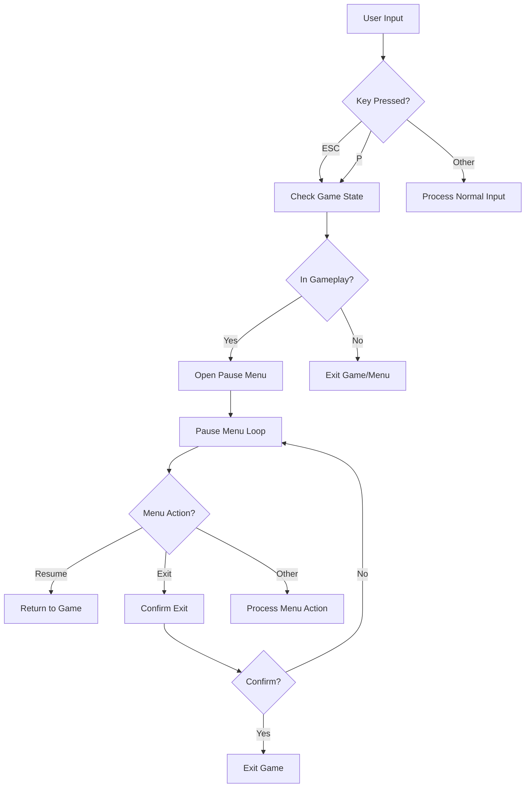

# Pause Menu Enhancement Design

## Overview

This design document outlines the enhancement of the Tetris Enhanced game's pause functionality to support ESC key activation and improve the existing pause menu with better exit handling. The current implementation already has a pause menu accessible via the 'P' key, but needs ESC key support and enhanced exit functionality.

## Current State Analysis

The existing codebase already includes:
- A functional pause menu accessible via 'P' key
- Menu buttons: Resume, Save, Load, Next Music, Previous Music, Exit
- Game state management with pause functionality
- Audio manager integration

## Technology Stack

- **Language**: Python 3.7+
- **Graphics Framework**: pygame
- **Architecture**: Single-file monolithic application
- **Input System**: pygame event handling
- **State Management**: GameState dataclass with pause flag

## Enhancement Requirements

### Functional Requirements

1. **ESC Key Pause Activation**: ESC key should open the pause menu during gameplay
2. **Enhanced Exit Button**: Improve exit button functionality in pause menu
3. **Consistent Input Handling**: Maintain existing 'P' key functionality alongside ESC
4. **State Preservation**: Ensure game state is properly preserved when pausing via ESC

### Non-Functional Requirements

1. **Performance**: No impact on game performance during normal gameplay
2. **Usability**: Intuitive pause menu access via common ESC key
3. **Compatibility**: Maintain backward compatibility with existing controls

## Architecture Design

### Input Event Flow



### State Management Enhancement

The existing `GameState` class already includes a `paused` boolean flag. The enhancement will utilize this existing infrastructure:

```python
@dataclass
class GameState:
    # ... existing fields ...
    paused: bool = False
    # ... rest of implementation ...
```

### Menu System Architecture

The current pause menu implementation will be enhanced with:

1. **Dual Key Activation**: Both ESC and P keys trigger pause menu
2. **Context-Aware ESC Behavior**: ESC behavior depends on current game state
3. **Enhanced Exit Confirmation**: Optional confirmation dialog for exit action

## Implementation Design

### Input Handler Enhancement

**Current ESC Key Handling:**
```python
if ev.key in (pygame.K_ESCAPE, pygame.K_q):
    pygame.quit(); sys.exit(0)
```

**Enhanced ESC Key Handling:**
```python
if ev.key == pygame.K_ESCAPE:
    if state.game_over:
        pygame.quit(); sys.exit(0)
    elif not state.paused and state.current is not None:
        # Open pause menu during active gameplay
        action = pause_menu(screen, clock, font, small, audio, state)
        # Process pause menu result
        handle_pause_menu_action(action, state, start_level)
    else:
        pygame.quit(); sys.exit(0)
```

### Pause Menu Enhancement

The existing `pause_menu()` function will be enhanced to:

1. **Return Structured Actions**: Return action objects instead of simple strings
2. **Handle ESC Key in Menu**: Allow ESC to resume game from pause menu
3. **Improved Exit Handling**: Better exit confirmation and state cleanup

**Enhanced Pause Menu Event Handling:**
```python
def pause_menu(screen, clock, font, small, audio: AudioManager, state: GameState):
    # ... existing setup code ...
    
    while True:
        # ... event loop ...
        if ev.type == pygame.KEYDOWN:
            if ev.key == pygame.K_p or ev.key == pygame.K_ESCAPE:
                return 'resume'  # ESC or P resumes game
            # ... other key handlers ...
        
        # ... mouse handling and rendering ...
```

### Action Handler Implementation

A new action handler function will centralize pause menu action processing:

```python
def handle_pause_menu_action(action, state, start_level):
    """
    Centralized handler for pause menu actions
    
    Args:
        action: Action returned from pause_menu()
        state: Current game state
        start_level: Starting level for new games
        
    Returns:
        Updated state or action for main loop
    """
    if action == 'resume' or action is None:
        return state  # Continue with current state
    elif action == 'quit':
        return 'quit'  # Signal main loop to exit
    elif isinstance(action, tuple) and action[0] == 'load':
        return action[1]  # Return loaded state
    # ... handle other actions ...
```

## User Experience Flow

### ESC Key Behavior Matrix

| Current State | ESC Key Action |
|---------------|----------------|
| Main Menu | Exit Game |
| Gameplay (Active) | Open Pause Menu |
| Gameplay (Paused) | Resume Game |
| Game Over | Exit Game |
| Pause Menu | Resume Game |

### Menu Navigation

The pause menu will support multiple navigation methods:
- **Mouse**: Click buttons to select actions
- **Keyboard**: ESC to resume, Enter to select highlighted option
- **Legacy**: P key continues to work for pause/resume

## Technical Implementation Details

### Event Processing Order

1. **Global Events**: QUIT event handling (highest priority)
2. **State-Specific Events**: ESC key behavior based on game state
3. **Gameplay Events**: Normal game input processing
4. **Menu Events**: Pause menu interaction handling

### Memory and Performance Considerations

- **No Additional Memory**: Reuse existing pause menu infrastructure
- **Minimal CPU Impact**: ESC key check adds negligible processing overhead
- **State Preservation**: Existing GameState serialization handles pause state

### Error Handling

- **Invalid State Transitions**: Prevent pause during hard drop animations
- **Menu Stack Management**: Ensure proper menu state cleanup
- **Input Validation**: Handle rapid ESC key presses gracefully

## Testing Strategy

### Unit Testing Scenarios

1. **ESC Key During Gameplay**: Verify pause menu opens correctly
2. **ESC Key During Pause**: Verify game resumes properly  
3. **ESC Key During Game Over**: Verify game exits cleanly
4. **Menu Navigation**: Test all pause menu button interactions
5. **State Preservation**: Verify game state maintains integrity through pause/resume cycles

### Integration Testing

1. **Audio System**: Ensure music pauses/resumes correctly
2. **Save/Load**: Verify save/load functionality works from ESC-triggered pause menu
3. **Animation States**: Test pause behavior during various game animations
4. **Input Conflicts**: Ensure no conflicts between P and ESC key handling

## Configuration and Customization

### Control Mapping

The enhanced system will maintain the existing control scheme while adding ESC functionality:

```python
# Enhanced control documentation
CONTROLS = {
    'move_left': 'LEFT_ARROW',
    'move_right': 'RIGHT_ARROW', 
    'soft_drop': 'DOWN_ARROW',
    'hard_drop': 'SPACE',
    'rotate_cw': 'UP_ARROW, Z',
    'rotate_ccw': 'X',
    'hold': 'C, SHIFT',
    'pause': 'P, ESC',  # Enhanced: Both keys work
    'restart': 'R',
    'quit': 'Q, ESC'    # Context-dependent
}
```

### Menu Customization

The pause menu layout and options remain unchanged to maintain familiarity:
- Resume (Продолжить)
- Save (Сохранить) 
- Load (Загрузить)
- Next Music (След. музыка)
- Previous Music (Пред. музыка)
- Exit (Выйти)

## Implementation Checklist

- [ ] Modify ESC key event handling in main game loop
- [ ] Update pause_menu() function to handle ESC key
- [ ] Implement handle_pause_menu_action() helper function
- [ ] Add context-aware ESC behavior logic
- [ ] Update control documentation in help panel
- [ ] Test ESC key functionality in all game states
- [ ] Verify audio system integration with ESC pause
- [ ] Test save/load functionality via ESC pause menu
- [ ] Validate game state preservation through pause cycles
- [ ] Update in-game help text to reflect ESC key functionality


